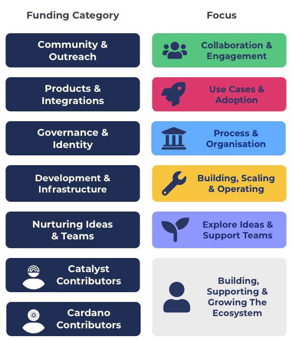
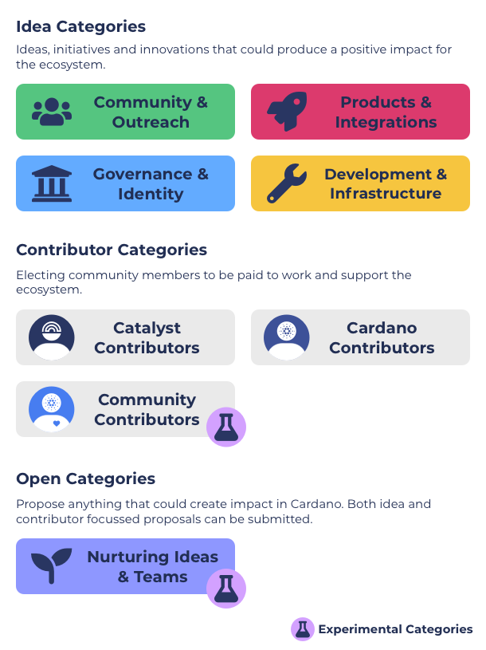

# Overview

Funding categories were creating to create a simple and effective solution for doing funding categorisation for the Catalyst funding process. Funding categories were created as a result of the [funding categorisation analysis](https://app.gitbook.com/o/Pr76HeHUxsbctwx0OULs/s/vZLnuW1KMXXsbdPSzee1/).

Funding categories were created to be a simpler and effective way to do funding categorisation. Idea funding categories are broad, inclusive, recurring and unique - they allow for any type of idea to be submitted.

### **Category types**

<figure><figcaption></figcaption></figure>

**Idea categories**

Any proposal with an idea, initiative or innovation can be submitted into these categories. Example ideas could include events, applications, tools, software libraries, community initiative efforts and many others.

**Contributor categories**

Proposals submitted by people in the community who want to work full time in the ecosystem to support and improve the ecosystem.

****

### **Funding categories list**

****

**Community & Outreach**

Community & Outreach focusses on helping bring the community together and be engaged in the ecosystem. It also is for supporting outreach to new potential community members and collaborations with external people and communities.

**=>** [**Read the Community & Outreach category brief**](idea-funding-categories/community-and-outreach.md)****

****

**Products & Integrations**

The Products & Integrations category focusses on finding projects that are building on top of Cardano such as DeFi, gaming, hardware devices, marketplaces, social media or any other product, application and integration.

**=>** [**Read the Products & Integrations category brief**](idea-funding-categories/products-and-integrations.md)****

****

**Governance & Identity**

Governance & Identity focusses on proposals that will help with improve and support both Catalyst and the wider ecosystem around how governance and identity is used in different communities such as through from different tools, libraries, SDKs, processes or research.

**=>** [**Read the Governance & Identity category brief**](idea-funding-categories/governance-and-identity.md)

****

**Development & Infrastructure**

Development & Infrastructure focuses on proposals that will help improve and maintain the Cardano developer ecosystem with tools, scripts, libraries and SDKs that make it easier for developers to build applications. It also includes infrastructure improvements with tools and resources that will make it as easy as possible for community members to secure and scale the network and run their own infrastructure and stake pool nodes.

**=>** [**Read the Development & Infrastructure category brief**](idea-funding-categories/development-and-infrastructure.md)****

****

**Nurturing Ideas & Teams**

Nurturing Ideas & Teams is about exploring how we can help to foster growth for ideas and new teams forming in the ecosystem. Any proposal type is welcomed as long as it is about the Cardano ecosystem in someway. There is a $40,000 maximum budget for proposals which helps to increase the number and diversity of teams and ideas that can be funded.

**=>** [**Read the Nurturing Ideas & Teams brief**](idea-funding-categories/nurturing-ideas-and-teams.md)

****

**Catalyst Contributors**

[Catalyst contributors](https://catalyst-swarm.gitbook.io/catalyst-contributors/) help with people who want to be paid to become a full time contributor in the Catalyst ecosystem to support and improve the Catalyst ecosystem. This can include helping with development, coordination, analysis, QA & auditing, marketing, product or design.

**=>** [**Read the Catalyst Contributors category brief**](https://catalyst-swarm.gitbook.io/catalyst-contributors/category-proposal/fund-8)****

****

**Cardano Contributors**

[Cardano contributors](https://catalyst-swarm.gitbook.io/cardano-contributors/) is for people who want to be paid to work as full time contributors in the Cardano ecosystem. This includes those who want to help support improving the stake pool ecosystem and the Cardano developer ecosystem. Contributors would help analyse, coordinate or develop tools, libraries and SDKs for the ecosystem to use.

**=>** [**Read the Cardano Contributors category brief**](https://catalyst-swarm.gitbook.io/cardano-contributors/category-proposal/fund-8)****

****

**Catalyst Natives**

Catalyst Native is a model used in Catalyst where external communities can setup their own funding challenge with an allotted budget for proposals. These challenges set by these communities may or not be recurring and may only be included for one funding round.

### Contents

* [**Idea Categories**](broken-reference) - A list of idea funding categories that were created due to the [idea categorisation analysis](https://app.gitbook.com/o/Pr76HeHUxsbctwx0OULs/s/wD0ZpGoCt4aFrCJnqaW0/).
* [**Contributor Categories**](broken-reference) - A list of contributor funding categories that were created due to the [contributor categorisation analysis](https://app.gitbook.com/o/Pr76HeHUxsbctwx0OULs/s/gdWEUdtxBpngJ9kJPPlB/).
* ****[**Questions & Discussion**](broken-reference) - Collection of content and feedback from the community regarding funding categories.
* [**Budget Weighting Votes**](budget-weighting-votes/fund-8/budget-weighting-considerations.md) - A record of the votes taken that determine the budget weighting used for the funding categories.
