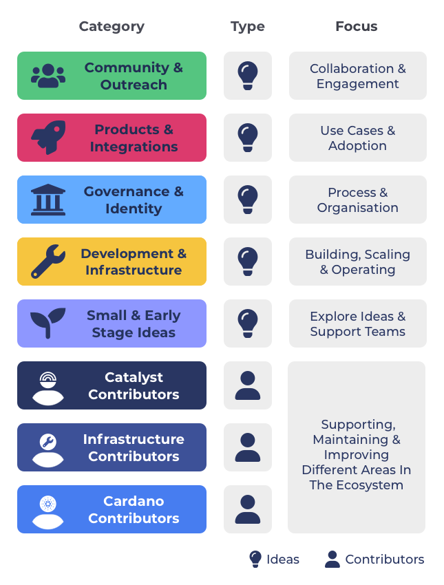

# Overview

Funding categories were created to find a more simple and effective solution for doing funding categorisation within the Catalyst funding process.

The following funding categories have been created based off the [funding categorisation analysis](https://app.gitbook.com/o/Pr76HeHUxsbctwx0OULs/s/vZLnuW1KMXXsbdPSzee1/). The analysis helped in identifying effective approaches to use for different types of funding categorisations. For idea categorisations this resulted in suggesting categorisations that leant towards being broad, inclusive, recurring and unique. For contributor categorisations this meant suggested categorisations that elected individuals, that would work full time for the ecosystem and that use fluid team structures, skill based roles, self determined budgets and term based working arrangements.

Category types in the list below below include:

* **Idea categories** - Categories which allow ideas to be submitted as proposals. Example ideas could include events, applications, tools, software libraries, community initiative efforts and many others.
* **Contributor categories** - Categories that allow people to work in the ecosystem to support, maintain and improve a certain areas in the ecosystem. People submit proposals about themselves, their professional background and any contributions made to the ecosystem to then be considered by the community who will then elect people to become contributors.

### **Funding categories list**

The following funding categories are not currently adopted and are just suggestions. Some or all of them could be adopted at some point in the future for the Catalyst funding process.&#x20;

<figure><figcaption></figcaption></figure>

**Community & Outreach**

Community & Outreach focusses on helping bring the community together and be engaged in the ecosystem. It also is for supporting outreach to new potential community members and collaborations with external people and communities.

**=>** [**Read the Community & Outreach category brief**](idea-funding-categories/community-and-outreach.md)****

****

**Products & Integrations**

The Products & Integrations category focusses on finding projects that are building on top of Cardano such as DeFi, gaming, hardware devices, marketplaces, social media or any other product, application and integration.

**=>** [**Read the Products & Integrations category brief**](idea-funding-categories/products-and-integrations.md)****

****

**Governance & Identity**

Governance & Identity focusses on proposals that will help with improve and support both Catalyst and the wider ecosystem around how governance and identity is used in different communities such as through from different tools, libraries, SDKs, processes or research.

**=>** [**Read the Governance & Identity category brief**](idea-funding-categories/governance-and-identity.md)

****

**Development & Infrastructure**

Development & Infrastructure focuses on proposals that will help improve and maintain the Cardano developer ecosystem with tools, scripts, libraries and SDKs that make it easier for developers to build applications. It also includes infrastructure improvements with tools and resources that will make it as easy as possible for community members to secure and scale the network and run their own infrastructure and stake pool nodes.

**=>** [**Read the Development & Infrastructure category brief**](idea-funding-categories/development-and-infrastructure.md)****

****

**Small & Early Stage Ideas**

Small & Early Stage Ideas is about exploring how we can help to foster growth for ideas and new teams forming in the ecosystem. Any proposal type is welcomed as long as it is about the Cardano ecosystem in someway. There is a $40,000 maximum budget for proposals which helps to increase the number and diversity of teams and ideas that can be funded.

**=>** [**Read the Small & Early Stage Ideas brief**](idea-categories/small-and-early-stage-ideas.md)

****

**Catalyst Contributors**

****[**Catalyst contributors**](https://app.gitbook.com/o/Pr76HeHUxsbctwx0OULs/s/j1kv4hiNJHn5g0WEyrK5/) help with people who want to be paid to become a full time contributor in the Catalyst ecosystem to support and improve the Catalyst ecosystem. This can include helping with development, coordination, analysis, QA & auditing, marketing, product or design.

**=>** [**Read the Catalyst Contributors category brief**](https://app.gitbook.com/o/Pr76HeHUxsbctwx0OULs/s/j1kv4hiNJHn5g0WEyrK5/)****

****

**Infrastructure Contributors**

****[**Infrastructure contributors**](https://app.gitbook.com/o/Pr76HeHUxsbctwx0OULs/s/qOxGN6OZJwo22azqs7YJ/) is for people who want to be paid to work as full time contributors in the Cardano ecosystem. This includes those who want to help support improving the stake pool ecosystem and the Cardano developer ecosystem. Contributors would help analyse, coordinate or develop tools, libraries and SDKs for the ecosystem to use.

**=>** [**Read the Infrastructure Contributors category brief**](https://app.gitbook.com/o/Pr76HeHUxsbctwx0OULs/s/qOxGN6OZJwo22azqs7YJ/)****

****

**Cardano Contributors**

****[**Cardano contributors**](https://app.gitbook.com/o/Pr76HeHUxsbctwx0OULs/s/2eMNRBUQ0glQkTBdpRi2/) is an experimental category for people who are looking to work in the wider Cardano ecosystem and support, maintain and improve initiatives happening in the community that help to produce impact for the ecosystem.

\=> [**Read the Cardano Contributors category brief**](https://app.gitbook.com/o/Pr76HeHUxsbctwx0OULs/s/2eMNRBUQ0glQkTBdpRi2/)****

**Catalyst Natives**

Catalyst Native is a model used in Catalyst where external communities can setup their own funding challenge with an allotted budget for proposals. These challenges set by these communities may or not be recurring and may only be included for one funding round.

### Contents

* [**Idea Categories**](broken-reference) - A list of idea funding categories that were created due to the [idea categorisation analysis](https://app.gitbook.com/o/Pr76HeHUxsbctwx0OULs/s/wD0ZpGoCt4aFrCJnqaW0/).
* [**Contributor Categories**](broken-reference) - A list of contributor funding categories that were created due to the [contributor categorisation analysis](https://app.gitbook.com/o/Pr76HeHUxsbctwx0OULs/s/gdWEUdtxBpngJ9kJPPlB/).
* ****[**Questions & Discussion**](broken-reference) - Collection of content and feedback from the community regarding funding categories.
* [**Budget Weighting Votes**](budget-weighting-votes/fund-8/budget-weighting-considerations.md) - A record of the votes taken that determine the budget weighting used for the funding categories.
