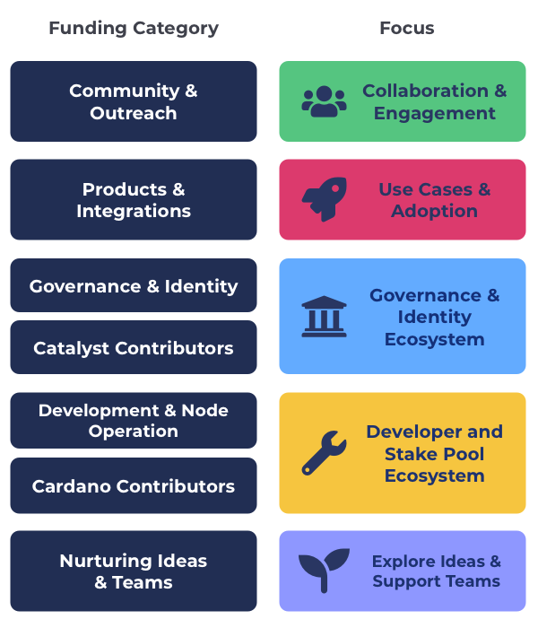

# Overview

The following are broad categories that provide a simpler way to do [funding allocation](../analysis/funding-categorisation-specificity.md). The categories below are inclusive in that they should allow for any type of idea or innovation to be included in any given funding round.

**Community & Outreach**

Focusses on helping bring the community together and engaged and also for outreach to new potential community members and collaborations with external people and organisations.&#x20;

**=>** [**Read the Community & Outreach category brief**](community-and-outreach.md)****

****

**Products & Integrations**

The products and integrations category focusses on helping fund projects looking to build on top of Cardano such as DeFi, gaming, hardware devices, marketplaces, social media or any other product, application and integration.

**=>** [**Read the Products & Integrations category brief**](products-and-integrations.md)****

****

**Governance & Identity**

The Governance & Identity category focusses on proposals that will help with improve and support both Catalyst and the wider ecosystem with tools, libraries, SDKs, processes or research that help lead to integrating better governance and identity solutions.

**=>** [**Read the Governance & Identity category brief**](governance-and-identity.md)

****

**Catalyst Contributors**

[Catalyst contributors](https://catalyst-swarm.gitbook.io/catalyst-contributors/) are a category for people to apply to work full time in the Catalyst ecosystem to support and improve the governance tools and processes used in Catalyst and the wider ecosystem. Proposals in this category are from candidates who would like to be paid to fulfil a certain role.

**=>** [**Read the Catalyst Contributors category brief**](https://catalyst-swarm.gitbook.io/catalyst-contributors/category-proposal/fund-8)****

****

**Development & Node Operation**

The Development & Node Operation category looks for proposals that will help improve and maintain the Cardano developer ecosystem with tools, scripts, libraries and SDKs that make it easier for developers to build applications. It also looks at supporting stake pool operation with tools and resources that will make it as easy as possible for people to help secure the network by running a stake pool node.

**=>** [**Read the Development & Node Operation category brief**](development-and-node-operation.md)****

****

**Cardano Contributors**

[Cardano contributors](https://catalyst-swarm.gitbook.io/cardano-contributors/) are a category for people to apply to work full time in the Cardano ecosystem. This includes those who want to help support improving the stake pool ecosystem and the Cardano developer ecosystem. Contributors would help analyse, coordinate or develop tools, libraries and SDKs for the ecosystem to use. Proposals in this category are from candidates who would like to be paid to fulfil a certain role.

**=>** [**Read the Cardano Contributors category brief**](https://catalyst-swarm.gitbook.io/cardano-contributors/category-proposal/fund-8)****

**Nurturing Ideas & Teams**

Nurturing Ideas & Teams is all about exploring how we can help to foster growth for ideas and new teams forming in the ecosystem. Any proposal type is welcomed as long as it is about the Cardano ecosystem in someway. There is a $40,000 maximum budget to increase the number of teams and ideas that can be funded to increase the idea and team diversity.&#x20;

**=>** [**Read the Nurturing Ideas & Teams brief**](nurturing-ideas-and-teams.md)

****

**Catalyst Natives**

Other ecosystem projects can introduce their own funding challenges into the process with their own self determined funding allocation amounts for rewarding proposals.
